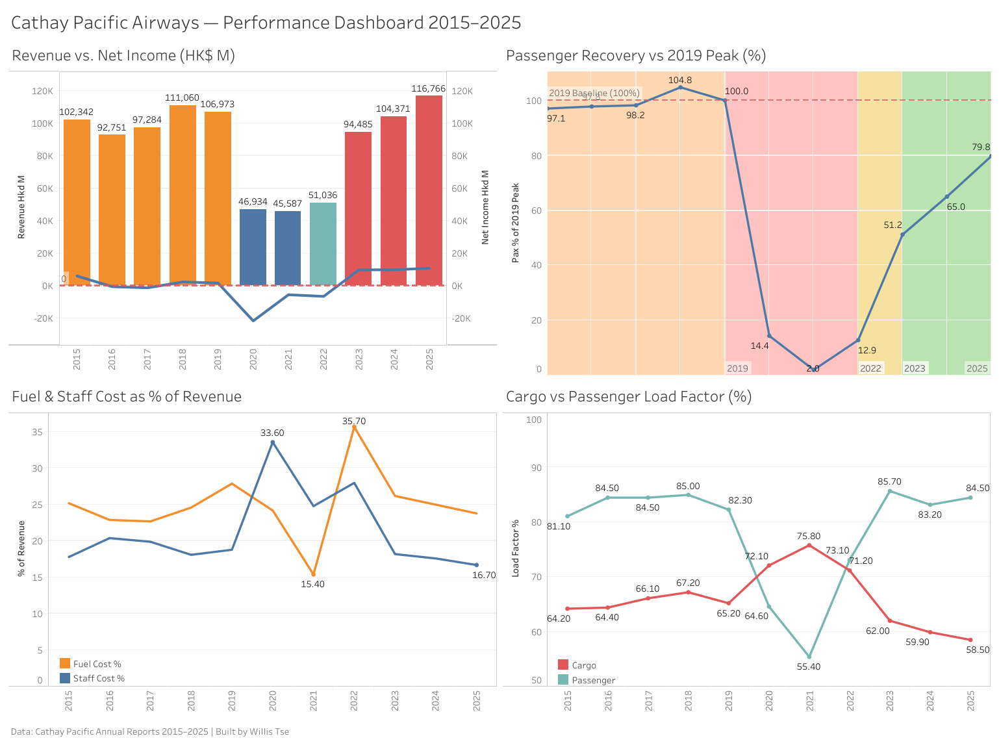

# Cathay Pacific Airways — Data Analytics Project



## Overview

A complete end-to-end data analytics project analysing **Cathay Pacific Airways** across 11 years (2015–2025), covering the airline's pre-COVID peak, the devastating pandemic collapse, and its ongoing recovery.

This project demonstrates a full analytics pipeline — from database design and SQL analysis to interactive visual dashboards — built on real data sourced from Cathay Pacific's official annual results announcements.

---

## Key Findings

- **Revenue collapsed 56%** in 2020 — the largest single-year drop in the airline's history (HK$107B → HK$47B)
- **Passenger volume hit 2% of 2019 levels** in 2021 — just 717,000 passengers for the entire year, roughly one week of normal operations
- **Cargo saved the airline during COVID** — cargo load factor peaked at 75.8% in 2021 while passenger operations were near-zero, providing critical revenue when passenger flying was impossible
- **Cathay only turned cumulatively profitable again in 2025** — three consecutive strong recovery years (2023–2025) were needed to offset the HK$25B+ in cumulative COVID losses
- **2018 was Cathay's best overall year** — highest composite score across profitability, cost efficiency, and capacity metrics
- **Post-COVID Cathay is leaner** — cost per ATK dropped to 3.34 in recovery vs 3.80 pre-COVID, reflecting structural improvements from the pandemic restructuring
- **Revenue recovered faster than passengers** — by 2023, revenue was at 88% of 2019 levels while passengers were only at 51%, reflecting a deliberate premium pricing strategy

---

## Tools & Technologies
 
| Tool | Purpose |
|---|---|
| **PostgreSQL 18** | Database design, data storage |
| **SQL** | Data analysis and querying |
| **Tableau Public** | Interactive dashboard and visualisation |
| **VS Code** | Development environment |
 
---
 
## Project Structure
 
```
CX_project/
├── README.md
├── data/
│   ├── cx_financials.csv        # Financial data (2015–2025)
│   └── cx_operations.csv        # Operational data (2015–2025)
|   └── cx_tableau.csv           # Data for Tableau
├── sql/
│   ├── 0_create_table.sql
│   ├── 1_full_revenue_story.sql
│   ├── 2_passenger_volume_changes.sql
│   ├── 3_fuel_and_staff_cost_vs_revenue.sql
│   ├── 4_cumulative_profit_analysis.sql
│   ├── 5_load_factor_vs_profitability.sql
│   ├── 6_cost_efficiency_ranking.sql
│   ├── 7_recovery_speed.sql
│   ├── 8_year_on_year_changes.sql
│   ├── 9_composite_performance_ranking.sql
│   ├── 10_cargo_performance.sql
│   └── 11_export_for_tableau.sql
└── dashboard/
    └── cx_dashboard.png
```
 
---

## Dashboard
 
**Live dashboard:** [Tableau Public — Cathay Pacific Performance Dashboard 2015–2025](https://public.tableau.com/views/CathayPacificPerformanceDashboard2015-2025/Dashboard1?:language=en-US&:sid=&:redirect=auth&:display_count=n&:origin=viz_share_link)
 
The dashboard contains four charts:
 
1. **Revenue vs Net Income** — dual-axis bar and line chart showing the full 11-year financial arc, coloured by era
2. **Passenger Recovery vs 2019 Peak** — line chart with era bands showing the collapse to 2% and the ongoing recovery
3. **Fuel & Staff Cost as % of Revenue** — dual line chart showing the 2020 crossover where staff costs overtook fuel costs
4. **Cargo vs Passenger Load Factor** — dual line chart showing how cargo compensated when passengers disappeared
---
